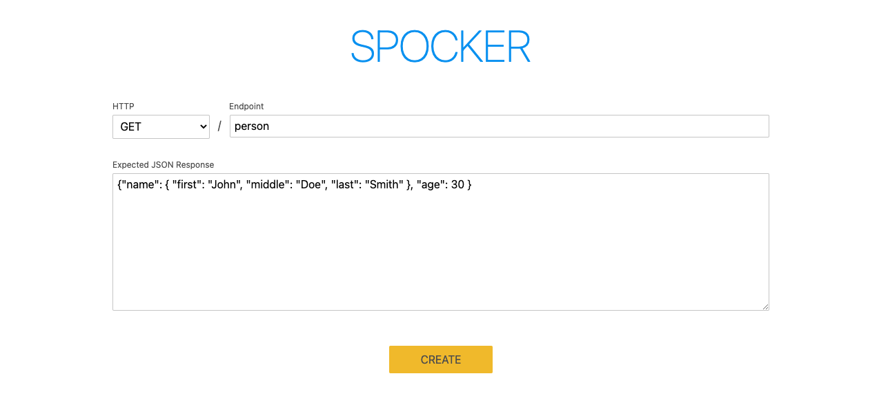
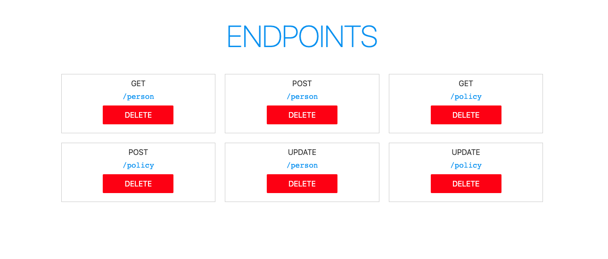
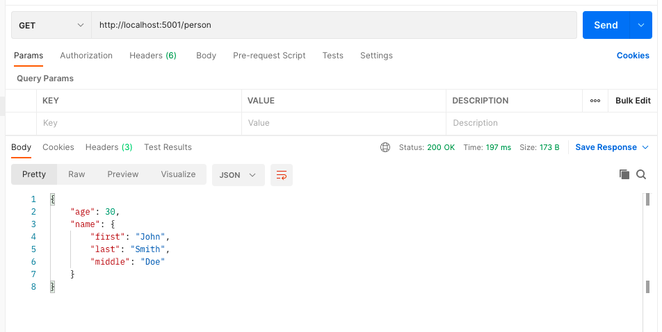

# Spocker

Instantly create mock endpoints for testing your frontend applications locally. Built with Svelte and Go.

Fill out a simple form to create a new endpoint:


Managing existing endpoints with a simple dashboard:


And that's it.


# Setup
## Run with Docker Compose
Recommended

### Downloads
- [Docker Compose](https://docker-docs.netlify.app/compose/install/)

### Instructions

1. Run the following command in the root folder of this project:
    
    `docker compose up -d`

2. Open Spocker by navigating to the following URL in a browser:
    
    `http://localhost:5000`

3. Call new endpoints at with the following as your base URL:

    `http://localhost:5001`

## Run without Docker

### Downloads

- [npm](https://docs.npmjs.com/downloading-and-installing-node-js-and-npm)
- [go](https://go.dev/doc/install)
- [gin](https://github.com/gin-gonic/gin#installation)
- [MongoDB](https://docs.mongodb.com/manual/installation/)

### Instructions
1. Run the following command in the root folder of this repository:

```
gin --appPort 5001 --port 5005 --immediate --build . --path main.go --bin spocker
```

2. Run `npm run dev` in the `web` folder of this repository. Change the baseUrl in `App.svelte` and `EndpointCard.svelte` as needed.
3. Make sure your local instance of MongoDB is running. Change the connection string in `mongodb.go` as needed.

## Backlog

Priority
- Empty Response
- Update

Future
- Expected authentication for mock endpoints
- Logging